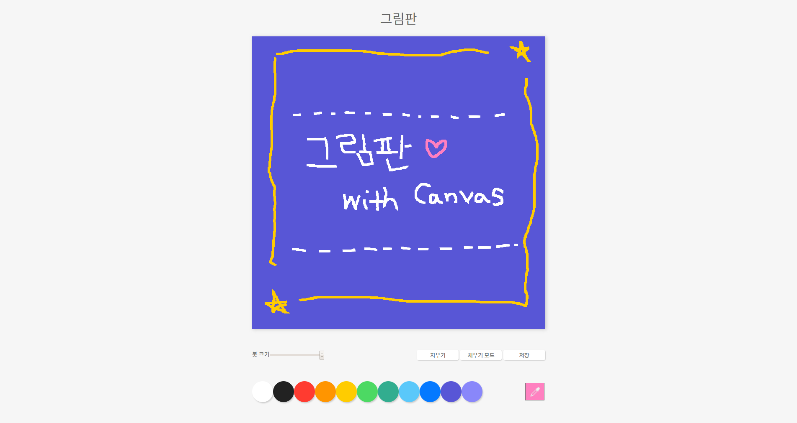

# js-paint

노마드코더의 자바스크립트 강의를 보고 만든 클론 코딩
[[바로가기]](https://may54ther.github.io/js-paint)

 

## 기능

- Canvas
- 그리기, 채우기, 붓 크기, 색상 선택, 저장
- 추가\*\_colorPicker로 색상 선택, 지우기

 

## 개인 정리

### Mouse Event

> - mousemove
>   대상에 마우스 진입 및 이동 시
> - mouseenter
>   대상에 마우스 진입 시
> - mousedown
>   대상을 클릭하고 있을 때
> - mouseup
>   대상에 마우스 클릭 종료 시
> - mouseleave
>   대상에서 마우스가 떠날 때
>    

### event.coords

> - event.offsetX, Y
>   이벤트 대상에 위치한 마우스의 좌표
> - event.clientX, Y
>   현재 보이는 브라우저 화면에서의 좌표, 스크롤 무시
> - event.pageX, Y
>   전체 문서 기준에서의 좌표, 스크롤 포함
> - event.screenX, Y
>   브라우저가 아닌 모니터 화면 기준의 좌표

 

## 미리보기

